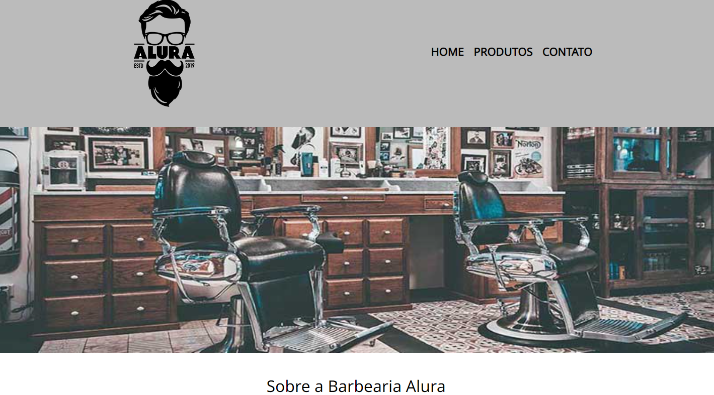

<h1 align="center"> Barbearia Alura </h1>

Site da Barberia Alura realizado junto a plataforma Alura - curso HTML5 e CSS3   

  <a href="#-tecnologias">Tecnologias</a>&nbsp;&nbsp;&nbsp;|&nbsp;&nbsp;&nbsp;
  <a href="#-projeto">Projeto</a>&nbsp;&nbsp;&nbsp;
  

 

  

## 🚀 Tecnologias

Esse projeto foi desenvolvido com as seguintes tecnologias:

- HTML e CSS

## 💻 Projeto

Projeto realizado junto ao curso de HTML5 e CSS3 do iniciante ao avançado da plataforma Alura.